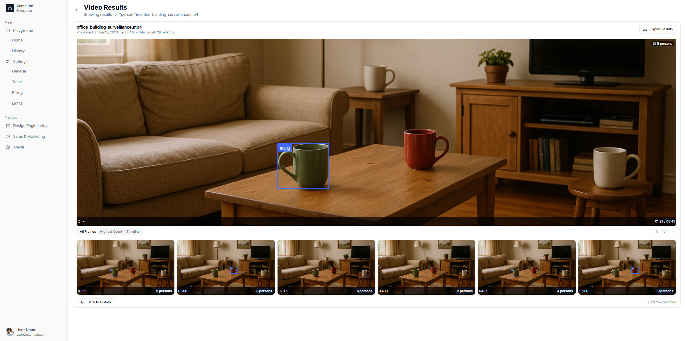
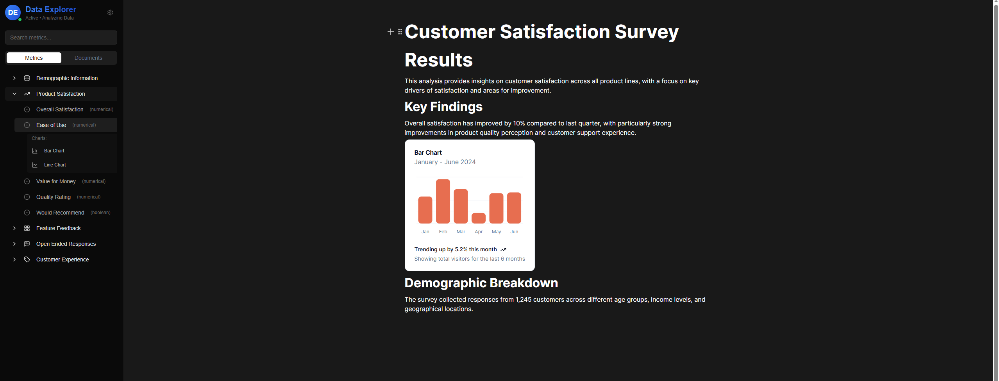
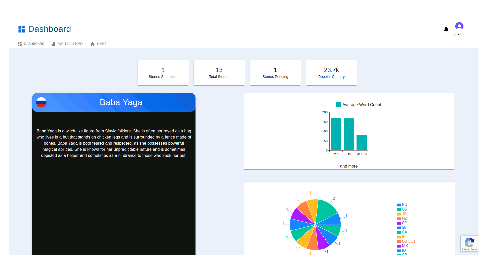
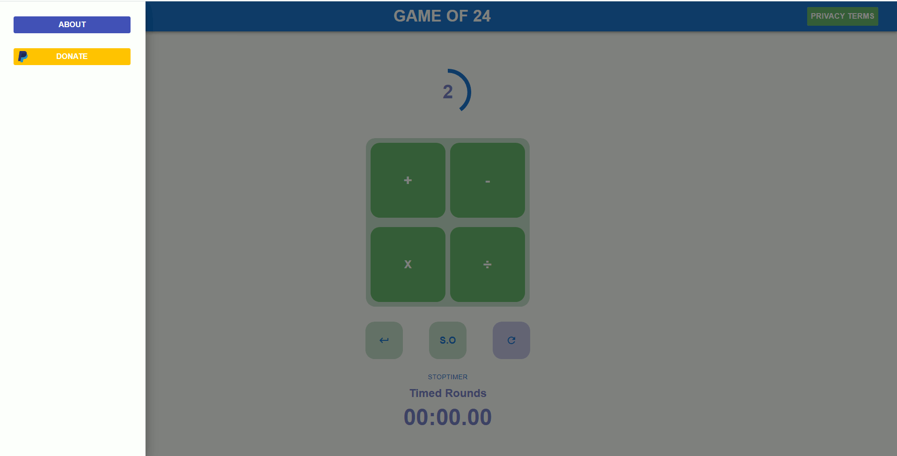

# My Portfolio of Projects

___Hello! My name is Jose. I'm an aspiring Fullstack Developer eager to grow and build a diverse, meaningful portfolio through hands-on learning and experimentation.___

# Contact Details

* ( www.linkedin.com/in/jose-avalos-thompson-6ba002127 )

# Languages and Skills

* 
* 
* 
* 
*   
* 

---

### Red Sun Lease Management

* Description: A modern lease management system featuring real-time version control, dynamic form generation, and a streamlined interface for managing property leases. Includes sample lease templates and interactive lease editing capabilities.  
* Tools: Next.js, React, TypeScript, Tailwind CSS, Framer Motion, PostgreSQL (Cloud SQL), Cloud Run, Cloud Storage, Firebase Auth,

 

### Video Object Search

* Description: Leverage AI to search for specific objects within video content. Upload a video, define your target object, and receive frame-by-frame results highlighting where the object appears.  
* Tools: Next.js, TypeScript, Tailwind CSS, Framer Motion, FastAPI, Python, Google Cloud Storage, Gemini (Google AI), Firebase Auth, 

 

### Survey Analytics Platform

* Description: Graph-based knowledge management system inspired by Notion and Blocknote, specialized for survey data analysis. Features AI-powered insights, multiple classification methods, and interactive visualizations within a connected graph interface for more intuitive data relationships and comprehensive analysis.  
* Tools: FastAPI, Python, PostgreSQL, Firebase, Firestore, Plotly, Gemini, SQLAlchemy, Pandas

---

### 3D Family Render

* Website: https://lsfamilytree.vercel.app  
* Description: This project presents an interactive 3D graph designed to visualize complex relationships between characters, inspired by the dynamic interactions within the Los Santos community. It aims to offer insights into how characters are interconnected through various relationships, excluding marital status to focus on the adoption meta and other significant connections. This visualization tool is an excellent resource for anyone interested in the intricate web of relationships and seeking a comprehensive understanding of community ties.  
* Tools: React, Vercel, Material-UI, three.js, React Hooks, React Force Graph, CSS

 

### Folklore Web Service

* Repository: (https://github.com/joseb2/folklore.io)  
* Description: FolkloreAPI is a web service for the everyday writer, inspired artist etc. It stemmed from my desire to start writing where, in doing some research, I found inspiration from various forums and articles on the different categories of folklore and their origins. The hope is for users to submit their own versions of folklore stories to the web service and for it be freely accessible to others looking for the same type of resource.  
* Tools: REACT, Express, Axios, JavaScript, HTML, CSS, NodeJS, Leaflet

 

### Game of 24

* Website: www.twentyfourgame.io  
* Description: A simple development of the popular math game, 24. The goal of the game is to reach 24 using each number at least once. The implementation was a good test of front-end skills though the implementation is slightly incomplete.  
* Tools: REACT, Javascript, HTML, CSS, NextJS
